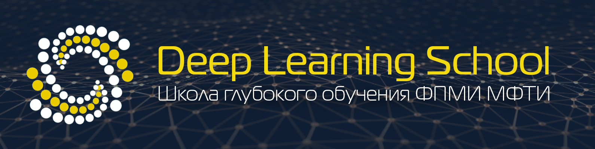

<h1 style="text-align:center">Deep Learning School</h1>

 

Официальный сайт: https://www.dlschool.org/

Школа глубокого обучения (Deep Learning School) — кружок от ФПМИ МФТИ, рассчитанный на старшеклассников, интересующихся программированием и математикой, а также студентов, которые хотят начать заниматься глубоким обучением. Занятия ведут студенты Физтех-школы прикладной математики и информатики МФТИ.

## [Домашние задания](homework)

- [Основы машинного обучения](homework/[homework,adv]knn.ipynb)
- [Решение задачи оттока и Kaggle](homework/[homework,adv]churn_boosting.ipynb)
- [Сверточные и полносвязные нейросети](homework/[homework,adv]pytorch_conv.ipynb)
- [Классификация Симпсонов](homework/[homework,adv]efficientnet_simpsons.ipynb)
- [Сегментация медецинских изображений](homework/[homework,adv]semantic_segmentation.ipynb)
- [Автоэнкодеры. Вариационные автоэнкодеры](homework/[homework,adv]autoencoders.ipynb)

## Диплом

Диплом МФТИ DLSchool II степени за успешное прохождение курса - [диплом](diploma.pdf)

## [Программа и материалы курса (Part 1 Advanced)](materials)

1. Элементы теории оптимизации. Градиент. Градиентный спуск. Линейные модели

2. Введение в глубокое обучение. Перцептрон. Нейрон с сигмоидой (и другими функциями активации). Основы ООП в Python

3. Библиотека PyTorch. Многослойные нейросети

4. Обучение нейронных сетей на практике. Cifar10, notMNIST

5. Сверточные нейросети. Сверточный слой. Пулинг слой

6. Практика обучения нейросетей. Классификация дорожных знаков

7. Transfer Learning. Популярные в Computer Vision архитектуры

8. Сегментация картинок. U-Net

9. Участие в соревнованиях на Kaggle

10. Object Detection.

11. Классический GAN. Нейронный перенос стиля
